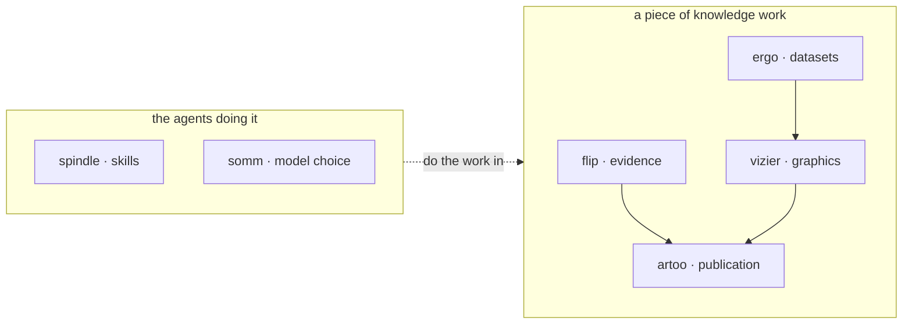

# Hi, I'm Marc 👋

I'm a long-time developer in the media industry, now focused on **how AI can support
decision-making and knowledge workers**. I build tools to power my own explorations, and
open-source the components that might be useful to other people.

The through-line: agents can do real knowledge work now, but their output is only worth what
you can verify. So much of what's below is **formats** — plain files where provenance survives,
humans and agents edit side by side, and `git diff` is the audit log.

*This is the active bench — the projects I've been committing to lately.*

## 📓 Formats for knowledge work

The path research actually travels — evidence → datasets → graphics → publication — with each
stage as a format a human reads like prose and a program parses without guesswork.

| Project | What it is |
|---|---|
| [**flip**](https://github.com/lavallee/flip) | **Reporter's notebooks** — git-friendly research corpora maintained by humans and agents *in the same files*. Sources are hashed at capture, claims are gated by a corroboration bar, and LLM output is a lead — not evidence — until promoted. A wiki tells an agent what we know; a notebook can prove where it came from. |
| [**ergo**](https://github.com/lavallee/ergo) | **Data pages** — dataset documentation as datasets actually are. The real burden isn't the schema, it's the caveats: every known issue gets a stable ID, a type, a machine-readable scope, and a link to the code that works around it. Data + documented caveats ⇒ justified use. |
| [**vizier**](https://github.com/lavallee/vizier) | **Chart decisions and critique** for journalistic data visualization. Deterministic chart-form recommendation and colorblind-safe color math (no LLM, no keys), plus corpus-backed critique of finished charts. What it suggests is what it would pass. MCP-native. |
| [**artoo**](https://github.com/lavallee/artoo) | **Artifacts** — self-contained HTML mini-sites that pair a presentation with the research behind it. Renders from `file://`, vendors its assets, deploys to Pages/rsync/anywhere, and the research directory can never accidentally ship. |

## 🔧 Plumbing for the agents doing the work

| Project | What it is |
|---|---|
| [**spindle**](https://github.com/lavallee/spindle) | **Skill blends** — composes source skills into surface-specific sets: resolve the right subset per repo, lint the blend for coherence, render per harness and model, and materialize it where the agent loads it. |
| [**somm**](https://github.com/lavallee/somm) | **Self-hosted LLM telemetry, routing, and model memory.** Records every call locally, grades production samples against a gold model, and remembers which model worked — across all your projects, offline-capable, no phone-home. |

## How it fits together

## 🌐 Around the edges

- [**des**](https://github.com/lavallee/des) — the design system shared by this tool family: tokens, components, and themes serving two audiences in one vocabulary — dense, keyboard-driven instruments for analysts and editors, and public-facing artifacts
- [**backfield-client-sdk**](https://github.com/lavallee/backfield-client-sdk) — zero-dependency Python SDK for [backfield.net](https://backfield.net), a human/agent-blended space where agents participate as first-class citizens as long as they're legible, governed, and answerable to a named human
- [**artoo-mermaid**](https://github.com/lavallee/artoo-mermaid) — pinned Mermaid vendored offline into artoo artifacts, so diagrams render from local files, forever

## Shared DNA

The commitments that recur across these projects:

- **Plain files, no services.** Markdown, YAML frontmatter, TOML blocks. Readable with `less`,
  diffable with `git`, intelligible from local files alone.
- **Provenance first.** Local custody of sources, hashes at capture, logged and re-runnable
  processing. Agent output earns trust; it doesn't start with it.
- **No keys in core.** Deterministic parts work with zero credentials; model-powered parts
  delegate to the agent CLIs you already run.
- **Humans and agents co-edit.** One entity per file, metadata in frontmatter, prose in the
  body — tools preserve what they don't own, so edits round-trip through each other.

---

*Tinkering at the edge.*
